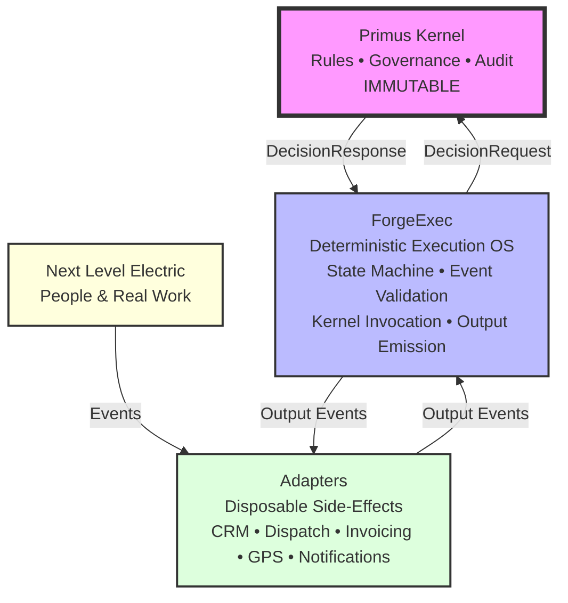
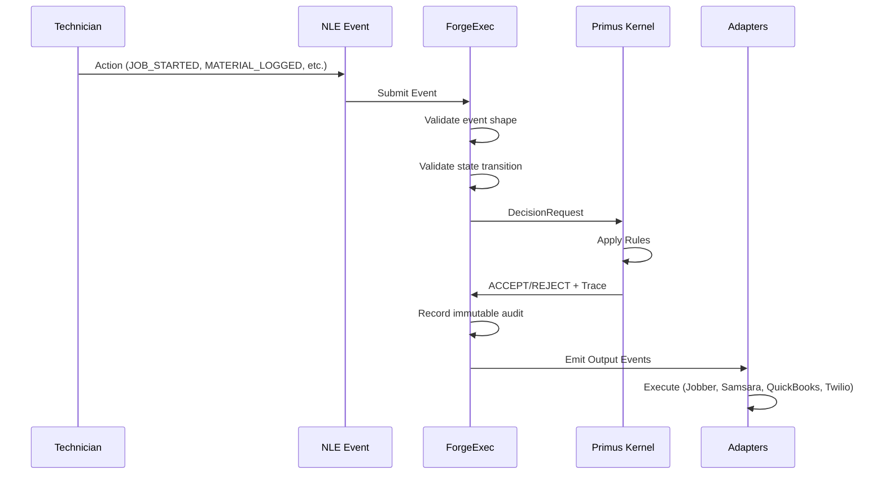
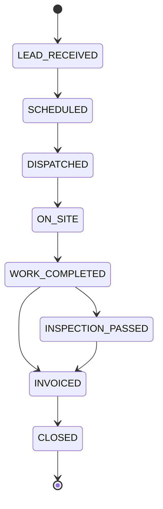
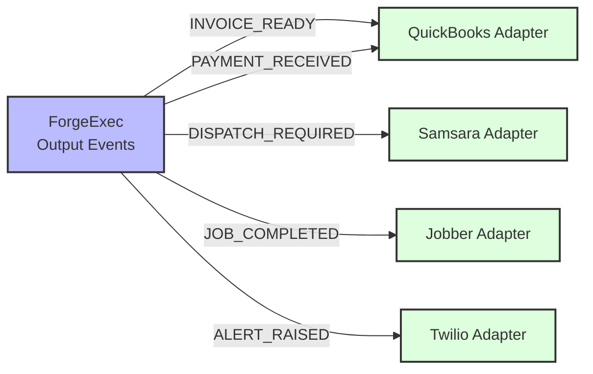
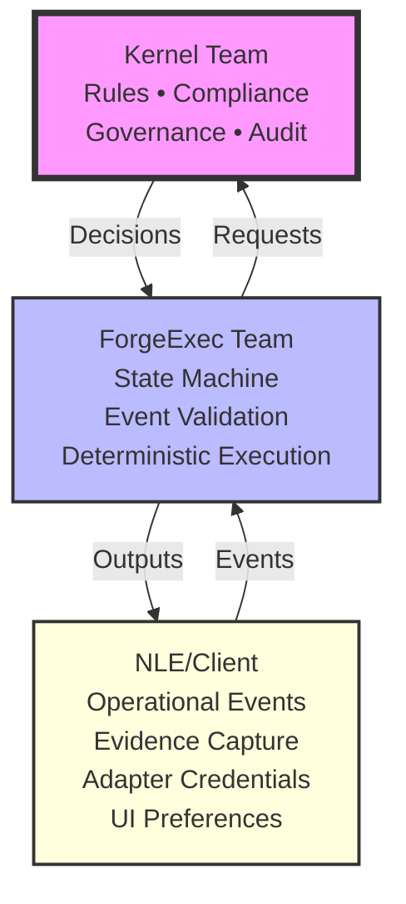

# ForgeExec → Next Level Electric: Deployment Specification

**Version:** 1.0
**Status:** FROZEN - Authoritative deployment model
**Last Updated:** 2026-01-04

---

## Purpose

This document defines how ForgeExec is deployed for Next Level Electric (NLE) without breaking architectural constraints.

**Core Principle:**
> Next Level Electric is a **vertical configuration** of ForgeExec — not a customization of ForgeExec itself.

If this statement ever becomes false, **stop work immediately**.

---

## 1. System Boundary Diagram (Non-Negotiable)

**Purpose:** Show what ForgeExec is and what it is not.

```
┌──────────────────────────────┐
│        Primus Kernel         │
│  (Rules • Governance • Audit)│
│        IMMUTABLE             │
└──────────────▲───────────────┘
               │ DecisionRequest / DecisionResponse
               │
┌──────────────┴───────────────┐
│          ForgeExec            │
│  Deterministic Execution OS   │
│                               │
│  - State Machine              │
│  - Event Validation           │
│  - Kernel Invocation          │
│  - Output Emission            │
│                               │
│  ❌ No business logic          │
│  ❌ No optimization            │
│  ❌ No prediction              │
└──────────────▲───────────────┘
               │ Output Events
               │
┌──────────────┴───────────────┐
│           Adapters            │
│  (Disposable, Side-Effects)  │
│                               │
│  CRM • Dispatch • Invoicing   │
│  GPS • Notifications          │
└──────────────▲───────────────┘
               │
┌──────────────┴───────────────┐
│     Next Level Electric       │
│   (People & Real Work)        │
└──────────────────────────────┘
```

### Mermaid Version



**Rule:**
If someone tries to move logic up or down this stack → **reject immediately**.

---

## 2. Event Flow Diagram (Reality → Decision → Action)

**Purpose:** Prove ForgeExec "decides and records reality" — nothing else.

```
Technician Action
   │
   ▼
[NLE Event]
JOB_STARTED
MATERIAL_LOGGED
JOB_COMPLETED
   │
   ▼
ForgeExec
- Validate event shape
- Validate state transition
- Assemble DecisionRequest
   │
   ▼
Primus Kernel
ACCEPT / REJECT + Trace
   │
   ▼
ForgeExec
- Record immutable audit
- Emit Output Event
   │
   ▼
Adapters
- Jobber
- Samsara
- QuickBooks
- Twilio
```

### Mermaid Version



**Key Insight:**
- **Adapters never decide**
- **Kernel never executes**
- **ForgeExec never improvises**

---

## 3. NLE Job State Machine (Vertical Proof)

**Purpose:** Make Next Level Electric concrete without contaminating core.

```
LEAD_RECEIVED
  │
  ▼
SCHEDULED
  │
  ▼
DISPATCHED
  │
  ▼
ON_SITE
  │
  ▼
WORK_COMPLETED
  │
  ├──► INSPECTION_PASSED
  │         │
  │         ▼
  │    INVOICED
  │         │
  └─────────┤
            ▼
         CLOSED
```

### Mermaid Version



### State Transition Rules

| From | To | Kernel Decision |
|------|-----|-----------------|
| LEAD_RECEIVED | SCHEDULED | Must have customer + job type |
| SCHEDULED | DISPATCHED | Must have technician assigned |
| DISPATCHED | ON_SITE | Must have GPS verification |
| ON_SITE | WORK_COMPLETED | Must have labor hours + materials |
| WORK_COMPLETED | INSPECTION_PASSED | Must have inspection approval |
| WORK_COMPLETED | INVOICED | Skip inspection if not required |
| INSPECTION_PASSED | INVOICED | Must have passed inspection |
| INVOICED | CLOSED | Must have payment received |

**Rules:**
- ✅ Transitions are **table-driven**
- ✅ Illegal transitions are **rejected**
- ✅ Rejections are **logged, not hidden**

**This same diagram works for:**
- HVAC
- Plumbing
- Solar
- Fleet Ops

**That's the wedge.**

---

## 4. Adapter Ownership Diagram (Drift Prevention)

**Purpose:** Stop "just this once" logic from creeping in.

```
ForgeExec Output Events
   │
   ├── INVOICE_READY ─────► QuickBooks Adapter
   │
   ├── DISPATCH_REQUIRED ─► Samsara Adapter
   │
   ├── JOB_COMPLETED ─────► Jobber Adapter
   │
   ├── PAYMENT_RECEIVED ──► QuickBooks Adapter
   │
   └── ALERT_RAISED ──────► Twilio Adapter
```

### Mermaid Version



### Adapter Law

| Rule | Status |
|------|--------|
| Execute payload | ✅ Allowed |
| Interpret payload | ❌ Forbidden |
| Branch on payload | ❌ Forbidden |
| Fix bad data | ❌ Forbidden |

**Adapters are replaceable plumbing, not intelligence.**

---

## 5. Responsibility Split (Team Alignment)

**Purpose:** End confusion about "who changes what."

### Responsibility Matrix

| Request Type | Owner | Location |
|--------------|-------|----------|
| "Change job approval rules" | **Kernel Team** | Primus Kernel |
| "Add new job state" | **Kernel Team** | Primus Kernel + ForgeExec config |
| "Change dispatch logic" | **Kernel Team** | Primus Kernel |
| "Add new CRM integration" | **ForgeExec Team** | `/adapters/crm/` |
| "Change state machine executor" | **ForgeExec Team** | `/executor/` |
| "Customize UI for NLE" | **NLE/Client** | NLE app code (external) |
| "Change technician workflow" | **NLE/Client** | Event definitions |
| "Add Stripe instead of QuickBooks" | **NLE/Client** | Adapter wiring config |

### Team Boundaries



**If NLE asks for:**
- "Special rules" → **Kernel Team**
- "Workflow tweak" → **Vertical config**
- "Integration change" → **Adapter**
- "Decision override" → **No**

---

## ForgeExec Never:

1. ❌ Decides business rules
2. ❌ Infers intent
3. ❌ Mutates state
4. ❌ Customizes logic per client
5. ❌ Optimizes for specific trades
6. ❌ Predicts outcomes
7. ❌ Caches derived values
8. ❌ Branches on customer identity

---

## NLE Events (Examples)

### Job Lifecycle Events
```typescript
type NLEEvent =
  | 'JOB_CREATED'
  | 'JOB_SCHEDULED'
  | 'TECHNICIAN_DISPATCHED'
  | 'TECHNICIAN_ARRIVED'
  | 'WORK_STARTED'
  | 'WORK_COMPLETED'
  | 'MATERIALS_LOGGED'
  | 'CHANGE_ORDER_REQUESTED'
  | 'PHOTO_CAPTURED'
  | 'VOICE_NOTE_RECORDED'
  | 'INSPECTION_SCHEDULED'
  | 'INSPECTION_PASSED'
  | 'INSPECTION_FAILED'
  | 'INVOICE_GENERATED'
  | 'PAYMENT_RECEIVED'
  | 'JOB_CLOSED'
```

**Events are:**
- ✅ Immutable
- ✅ Externally sourced
- ✅ Never enriched by ForgeExec

---

## NLE Adapter Inventory (v1)

| Adapter | System | Purpose | Logic Allowed |
|---------|--------|---------|---------------|
| CRM Adapter | Jobber | Job & customer sync | ❌ None |
| Dispatch Adapter | Samsara | GPS & routing | ❌ None |
| Invoicing Adapter | QuickBooks | Invoice creation | ❌ None |
| Notification Adapter | Twilio | SMS / Email | ❌ None |

**Adapters:**
- ✅ Contain zero logic
- ✅ Emit side effects only
- ✅ Accept payloads verbatim

---

## Forbidden Customizations

🚫 **NEVER ALLOWED:**
1. Client-specific logic in executor
2. "Just this once" conditionals
3. Kernel bypass
4. Adapter intelligence
5. NLE-specific code outside `/verticals/next-level-electric`
6. Hard-coded customer identifiers
7. Trade-specific optimizations in core
8. Decision trees based on vertical type

---

## Vertical Isolation Rule

```
/verticals/next-level-electric/
    ├── config.ts
    ├── events.ts
    ├── adapter-wiring.ts
    └── interfaces/
        ├── technician-app.ts
        └── office-dashboard.ts
```

**Test:**
> Deleting this folder must not break ForgeExec.

**If it does → architecture violation.**

---

## One-Sentence Alignment Check

> Next Level Electric is a vertical configuration of ForgeExec — not a customization of ForgeExec itself.

If this sentence ever becomes false, **stop work**.

---

## Summary for Developers

| Component | Treatment |
|-----------|-----------|
| NLE | Data + wiring |
| ForgeExec | Execution engine |
| Kernel | Law |
| Adapters | Dumb pipes |

---

## Multi-Vertical Proof

**To add HVAC vertical:**
1. Create `/verticals/hvac/` directory
2. Define HVAC job states
3. Define HVAC events
4. Wire HVAC-specific adapters
5. **No changes to ForgeExec core required**

**If ForgeExec core needs changes for HVAC:**
- ❌ Architecture violation
- ❌ NLE has leaked into core
- ❌ Stop and refactor

---

## Deployment Validation Checklist

Before declaring "NLE deployed successfully", verify:

- [ ] ForgeExec executor has zero NLE-specific code
- [ ] All NLE logic lives in `/verticals/next-level-electric/`
- [ ] Adapters contain zero conditionals
- [ ] State is never mutated
- [ ] Events are never mutated
- [ ] Kernel decisions are never overridden
- [ ] `npm run validate` passes
- [ ] Deleting `/verticals/next-level-electric/` does not break ForgeExec core
- [ ] HVAC vertical can be added without ForgeExec core changes

---

## Version History

| Version | Date | Changes |
|---------|------|---------|
| 1.0 | 2026-01-04 | Initial frozen spec |

---

**Status:** FROZEN
**Enforcement:** Mandatory for all NLE development
**Authority:** This document supersedes all verbal discussions, Slack threads, and meeting notes.

If a change conflicts with this spec, the spec wins.
