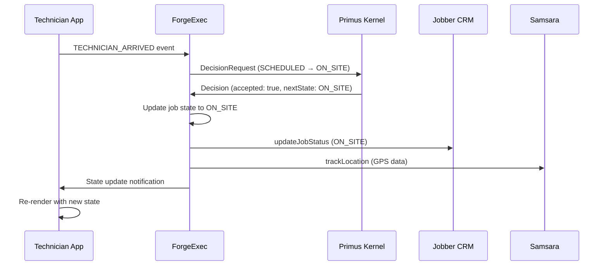
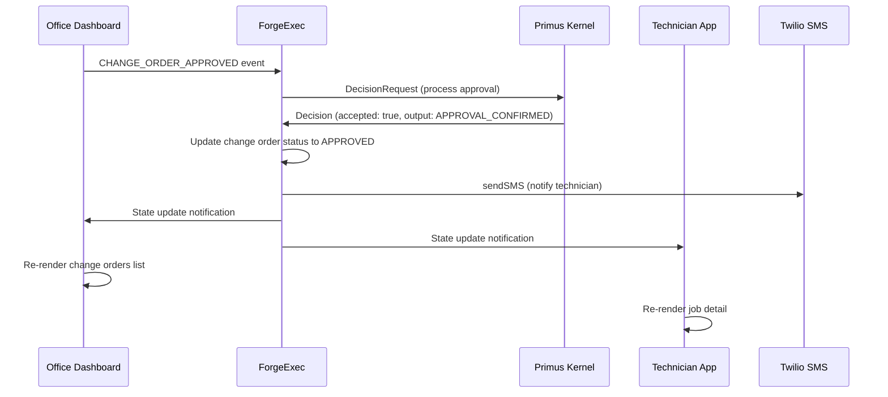
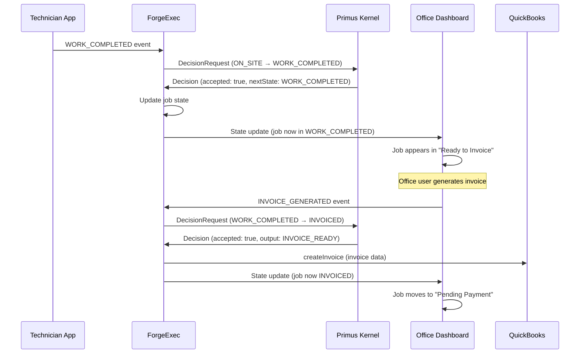

# NLE UX Flows (Wire frame Specs)

**Purpose:** Visual representation of user journeys through NLE UIs
**Status:** Wireframe-level only - NO LOGIC
**Last Updated:** 2026-01-04

---

## 1. Technician App Flows

### 1.1 Morning Start Flow

```
┌─────────────────────┐
│   Login Screen      │
│                     │
│  [Username]         │
│  [Password]         │
│                     │
│  [ Sign In ]        │
└──────────┬──────────┘
           │
           ▼
┌─────────────────────┐
│  Clock In Screen    │
│                     │
│  Tech: John Smith   │
│  GPS: ✓ Acquired    │
│  Lat: 45.5231       │
│  Lon: -122.6765     │
│                     │
│  [ Clock In ]       │
└──────────┬──────────┘
           │ Emits: TECHNICIAN_CLOCKED_IN
           ▼
┌─────────────────────┐
│   Job List Screen   │
│                     │
│  ┌───────────────┐  │
│  │ Panel Upgrade │  │
│  │ J. Anderson   │  │
│  │ SCHEDULED     │  │
│  │ 9:00 AM       │  │
│  └───────────────┘  │
│  ┌───────────────┐  │
│  │ Service Call  │  │
│  │ M. Chen       │  │
│  │ SCHEDULED     │  │
│  │ 11:00 AM      │  │
│  └───────────────┘  │
│                     │
└─────────────────────┘
```

### 1.2 Job Execution Flow

```
Job List → Select Job → Job Detail → Arrive → Start Work → Complete Work
   │                        │            │         │            │
   │                        │            │         │            │
   ▼                        ▼            ▼         ▼            ▼
┌──────────┐      ┌──────────────┐   ┌──────┐  ┌──────┐   ┌─────────┐
│          │      │ Customer:    │   │ GPS  │  │ Time │   │ Labor:  │
│ [Tap]    │──>   │ J. Anderson  │   │ Chk  │  │ Start│   │ 2.5 hrs │
│ Job      │      │              │   │      │  │      │   │         │
│ Card     │      │ Address:     │   │      │  │      │   │ Photos: │
│          │      │ 123 Main St  │   │      │  │      │   │ [3]     │
│          │      │              │   │      │  │      │   │         │
│          │      │ Type:        │   │      │  │      │   │ Inspect:│
│          │      │ PANEL_UPGRADE│   │      │  │      │   │ [✓] Yes │
│          │      │              │   │      │  │      │   │         │
│          │      │ State:       │   │      │  │      │   │ Notes:  │
│          │      │ SCHEDULED    │   │      │  │      │   │ [Text]  │
│          │      │              │   │      │  │      │   │         │
│          │      │ [ Arrive ]   │   │      │  │      │   │[Submit] │
└──────────┘      └──────┬───────┘   └──┬───┘  └──┬───┘   └────┬────┘
                         │              │         │             │
                         │              │         │             │
                    Event Emitted   Event     Event        Event
                    (none)          Emit      Emit         Emit
```

**Event Sequence:**

1. **Select Job** → Navigation only (no event)
2. **Arrive Button** → Emits `TECHNICIAN_ARRIVED`
3. **Start Work Button** → Emits `WORK_STARTED`
4. **Complete Work Button** → Emits `WORK_COMPLETED`

**State Updates:**

- After `TECHNICIAN_ARRIVED`: Kernel may transition to `ON_SITE`
- After `WORK_STARTED`: Kernel may add `workStartTime`
- After `WORK_COMPLETED`: Kernel may transition to `WORK_COMPLETED`

**UI Never Assumes:** State transitions are controlled by Kernel only.

### 1.3 Materials Logging Flow

```
Work Capture Screen → Materials Log → Select Items → Submit
       │                    │             │            │
       │                    │             │            │
       ▼                    ▼             ▼            ▼
┌─────────────┐    ┌──────────────┐  ┌──────────┐  ┌────────┐
│             │    │ Van Inventory│  │ Wire     │  │ Items: │
│ [ Photos ]  │    │              │  │ 10ft     │  │ - Wire │
│ [ Audio  ]  │--> │ ┌──────────┐ │  │ QTY: 2   │  │   10ft │
│ [Materials] │    │ │ Wire 10ft│ │  │          │  │   x2   │
│             │    │ │ Available│ │  │ Source:  │  │        │
│             │    │ │ Qty: 50  │ │  │ [✓] VAN  │  │ Total: │
│             │    │ │ $5 each  │ │  │ [ ] BUY  │  │ $10    │
│             │    │ └────┬─────┘ │  │          │  │        │
│             │    │      │       │  │ [Add]    │  │[Submit]│
└─────────────┘    │ ┌────▼─────┐ │  └──────────┘  └────┬───┘
                   │ │ Conduit  │ │                     │
                   │ │ 6ft      │ │                     │
                   │ │ Qty: 30  │ │              Emits Event:
                   │ │ $8 each  │ │              MATERIALS_LOGGED
                   │ └──────────┘ │
                   └──────────────┘
```

**Event Payload:**

```json
{
  "type": "MATERIALS_LOGGED",
  "payload": {
    "jobId": "job-001",
    "technicianId": "tech-123",
    "materials": [
      {
        "itemId": "wire-10ft",
        "description": "Wire 10ft",
        "quantity": 2,
        "source": "VAN",
        "cost": 5.00
      }
    ],
    "timestamp": "2026-01-04T14:30:00Z"
  }
}
```

**UI Constraints:**

- ❌ NO auto-deduction from van inventory
- ❌ NO cost totaling beyond display
- ✅ Submit exact quantities entered

### 1.4 Change Order Request Flow

```
Job Detail → Request Change Order → Fill Form → Submit → Wait for Approval
    │              │                    │          │           │
    │              │                    │          │           │
    ▼              ▼                    ▼          ▼           ▼
┌────────┐  ┌─────────────┐      ┌──────────┐  ┌──────┐  ┌─────────┐
│        │  │ Description │      │ Photos:  │  │      │  │ Status: │
│[Change │  │ [Text Area] │      │ [Camera] │  │      │  │ PENDING │
│ Order] │  │             │      │ [Upload] │  │      │  │         │
│        │->│ Est. Cost:  │----> │          │->│Emit  │->│ Waiting │
│        │  │ [$1,500]    │      │ Reason:  │  │Event │  │ for     │
│        │  │             │      │ [Select] │  │      │  │ Office  │
│        │  │ Est. Time:  │      │          │  │      │  │         │
│        │  │ [2 hours]   │      │ Priority │  │      │  │         │
│        │  │             │      │ [Medium] │  │      │  │         │
│        │  │ [Continue]  │      │ [Submit] │  │      │  │         │
└────────┘  └─────────────┘      └──────────┘  └──────┘  └─────────┘
```

**Event Emitted:** `CHANGE_ORDER_REQUESTED`

**UI Behavior:**

- Show form exactly as designed
- Emit event on submit
- ❌ NO approval/rejection logic in app
- ✅ Display pending status from state updates

---

## 2. Office Dashboard Flows

### 2.1 Job Scheduling Flow

```
Job Board → Create Job → Schedule → Dispatch
    │           │           │          │
    │           │           │          │
    ▼           ▼           ▼          ▼
┌──────────┐ ┌─────────┐ ┌────────┐ ┌────────┐
│          │ │Customer:│ │Tech:   │ │        │
│Scheduled │ │[Select] │ │[Select]│ │ GPS    │
│In Prog   │ │         │ │        │ │ Track  │
│Completed │ │Address: │ │Time:   │ │ Active │
│          │ │[Text]   │ │[Pick]  │ │        │
│[+ New]   │ │         │ │        │ │ [View] │
│          │ │Type:    │ │Est:    │ │        │
│          │ │[Select] │ │[Hours] │ │        │
│          │ │         │ │        │ │        │
│          │ │Priority │ │[Save]  │ │[Notify]│
│          │ │[Select] │ │        │ │        │
│          │ │         │ │        │ │        │
│          │ │[Create] │ │        │ │        │
└──────────┘ └────┬────┘ └───┬────┘ └───┬────┘
                  │           │          │
                  │           │          │
            JOB_CREATED  JOB_      TECHNICIAN_
                       SCHEDULED   DISPATCHED
```

**Event Sequence:**

1. **Create Job** → Emits `JOB_CREATED`
2. **Schedule** → Emits `JOB_SCHEDULED`
3. **Dispatch** → Emits `TECHNICIAN_DISPATCHED`

**State Updates:**

- After `JOB_CREATED`: Kernel creates job in `LEAD_RECEIVED` state
- After `JOB_SCHEDULED`: Kernel transitions to `SCHEDULED`
- After `TECHNICIAN_DISPATCHED`: Kernel transitions to `DISPATCHED`

**UI Kanban Board:**

```
┌──────────────────┬──────────────────┬──────────────────┐
│   SCHEDULED      │   IN PROGRESS    │   COMPLETED      │
├──────────────────┼──────────────────┼──────────────────┤
│ ┌──────────────┐ │ ┌──────────────┐ │ ┌──────────────┐ │
│ │ Panel Upgrade│ │ │ Service Call │ │ │ EV Charger   │ │
│ │ J. Anderson  │ │ │ M. Chen      │ │ │ K. Williams  │ │
│ │ Tech: John   │ │ │ Tech: Sarah  │ │ │ Tech: Mike   │ │
│ │ 9:00 AM      │ │ │ ON_SITE      │ │ │ INVOICED     │ │
│ └──────────────┘ │ └──────────────┘ │ └──────────────┘ │
│                  │                  │                  │
│ ┌──────────────┐ │ ┌──────────────┐ │ ┌──────────────┐ │
│ │ Emergency    │ │ │ New Install  │ │ │ Inspection   │ │
│ │ R. Taylor    │ │ │ D. Johnson   │ │ │ L. Martinez  │ │
│ │ Tech: Alex   │ │ │ Tech: Chris  │ │ │ Tech: Dana   │ │
│ │ ASAP         │ │ │ DISPATCHED   │ │ │ CLOSED       │ │
│ └──────────────┘ │ └──────────────┘ │ └──────────────┘ │
└──────────────────┴──────────────────┴──────────────────┘
```

**Filtering Logic:**

```typescript
// ✅ CORRECT: Filter by exact state value
const scheduledJobs = jobs.filter(j => j.currentState === 'SCHEDULED')
const inProgressJobs = jobs.filter(j =>
  ['DISPATCHED', 'ON_SITE', 'WORK_COMPLETED'].includes(j.currentState)
)
const completedJobs = jobs.filter(j =>
  ['INSPECTION_PASSED', 'INVOICED', 'CLOSED'].includes(j.currentState)
)
```

**UI Constraints:**

- ❌ NO drag-and-drop to change state
- ❌ NO auto-assignment of technicians
- ✅ Explicit button clicks only

### 2.2 Change Order Approval Flow

```
Dashboard → Change Orders → Review → Approve/Reject
    │            │            │           │
    │            │            │           │
    ▼            ▼            ▼           ▼
┌────────┐  ┌──────────┐  ┌───────┐  ┌────────┐
│        │  │ Pending  │  │ CO-123│  │        │
│[Badge] │  │ Approved │  │       │  │[Approve│
│  (5)   │  │ Rejected │  │ Job:  │  │ Notes] │
│        │  │          │  │ #J-001│  │        │
│        │->│┌────────┐│  │       │  │   OR   │
│        │  ││CO-123  ││->│ Desc: │->│        │
│        │  ││$1,500  ││  │ Panel │  │[Reject │
│        │  ││2 hours ││  │ Upsize│  │ Reason]│
│        │  ││Medium  ││  │       │  │        │
│        │  │└────────┘│  │ Cost: │  │        │
│        │  │          │  │$1,500 │  │[Submit]│
│        │  │          │  │       │  │        │
│        │  │          │  │ Time: │  │        │
│        │  │          │  │2 hours│  │        │
│        │  │          │  │       │  │        │
│        │  │          │  │Photos │  │        │
│        │  │          │  │[View] │  │        │
└────────┘  └──────────┘  └───────┘  └────┬───┘
                                           │
                                           │
                                    Emits Event:
                                    CHANGE_ORDER_APPROVED
                                    or
                                    CHANGE_ORDER_REJECTED
```

**Event Payloads:**

```json
// Approval
{
  "type": "CHANGE_ORDER_APPROVED",
  "payload": {
    "jobId": "job-001",
    "changeOrderId": "co-123",
    "approvedBy": "office-user-456",
    "approvalNotes": "Approved - customer verified",
    "timestamp": "2026-01-04T15:00:00Z"
  }
}

// Rejection
{
  "type": "CHANGE_ORDER_REJECTED",
  "payload": {
    "jobId": "job-001",
    "changeOrderId": "co-123",
    "rejectedBy": "office-user-456",
    "rejectionReason": "Exceeds budget - customer declined",
    "timestamp": "2026-01-04T15:00:00Z"
  }
}
```

**UI Constraints:**

- ❌ NO auto-approval if cost < threshold
- ❌ NO budget checks or warnings
- ✅ Explicit user decision only

### 2.3 Invoicing Flow

```
Dashboard → Invoicing → Select Job → Generate → Submit to QuickBooks
    │           │            │           │              │
    │           │            │           │              │
    ▼           ▼            ▼           ▼              ▼
┌────────┐  ┌──────────┐  ┌───────┐  ┌───────┐  ┌──────────┐
│        │  │ Ready:   │  │ Job:  │  │ Labor:│  │          │
│[Invoice│  │ (12)     │  │ J-001 │  │ 4.5hr │  │ QuickBook│
│ Badge] │  │          │  │       │  │ $450  │  │ Invoice  │
│  (12)  │  │ Pending: │  │ Cust: │  │       │  │ Created  │
│        │->│ (3)      │->│ J.And │->│ Matl: │->│          │
│        │  │          │  │       │  │ $120  │  │ Status:  │
│        │  │ Overdue: │  │ Comp: │  │       │  │ PENDING  │
│        │  │ (1)      │  │ 1/3   │  │ C.O.: │  │          │
│        │  │          │  │       │  │ $200  │  │          │
│        │  │┌────────┐│  │ Labor │  │       │  │          │
│        │  ││J-001   ││  │ 4.5hr │  │ Total:│  │          │
│        │  ││J.And   ││  │       │  │ $770  │  │          │
│        │  ││$770    ││  │[Gen]  │  │       │  │          │
│        │  │└────────┘│  │       │  │[Send] │  │          │
└────────┘  └──────────┘  └───────┘  └───┬───┘  └──────────┘
                                          │
                                          │
                                   Emits Event:
                                   INVOICE_GENERATED
```

**Event Emitted:** `INVOICE_GENERATED`

**UI Display Rules:**

```typescript
// ✅ CORRECT: Display exact values from state
<div>
  <p>Labor Hours: {job.laborHours}</p>
  <p>Materials: ${job.materialsUsed.reduce((sum, m) => sum + m.cost, 0)}</p>
  <p>Change Orders: ${job.changeOrderCosts}</p>
  {/* UI does NOT calculate total - backend provides it */}
</div>
```

**UI Constraints:**

- ❌ NO invoice total calculation
- ❌ NO tax computation
- ✅ Display values exactly as received

---

## 3. Mermaid Sequence Diagrams

### 3.1 Technician Arrives at Job



### 3.2 Office Approves Change Order



### 3.3 Complete Work → Invoice Flow



---

## 4. Screen Layout Mockups (ASCII)

### 4.1 Technician App - Job Detail Screen

```
┌──────────────────────────────────────────┐
│ ◀ Jobs            Job #J-001             │
├──────────────────────────────────────────┤
│                                          │
│  Customer: Jennifer Anderson             │
│  Phone: (503) 555-1234                   │
│                                          │
│  Address:                                │
│  123 Main Street                         │
│  Portland, OR 97201                      │
│                                          │
│  Job Type: PANEL_UPGRADE                 │
│  Scheduled: Today 9:00 AM                │
│                                          │
│  Current State: SCHEDULED                │
│                                          │
│  ┌──────────────────────────────────┐   │
│  │ Job Notes:                       │   │
│  │ Customer wants 200A panel        │   │
│  │ upgrade. Main panel in garage.   │   │
│  │ Parking in driveway available.   │   │
│  └──────────────────────────────────┘   │
│                                          │
│  Required Materials:                     │
│  • 200A Panel                            │
│  • Breakers (qty varies)                 │
│  • Wire/conduit                          │
│                                          │
├──────────────────────────────────────────┤
│  [       I've Arrived       ]            │
│  [      Start Work          ]            │
│  [    Request Change Order  ]            │
└──────────────────────────────────────────┘
```

### 4.2 Office Dashboard - Job Board Screen

```
┌───────────────────────────────────────────────────────────────────┐
│  Next Level Electric - Job Board                     [+ New Job]  │
├───────────────────────────────────────────────────────────────────┤
│                                                                    │
│  ┌─────────────┬──────────────┬───────────────┬──────────────┐   │
│  │ SCHEDULED   │ DISPATCHED   │ ON SITE       │ COMPLETED    │   │
│  ├─────────────┼──────────────┼───────────────┼──────────────┤   │
│  │┌───────────┐│┌────────────┐│┌─────────────┐│┌────────────┐│   │
│  ││ J-001     │││ J-003      │││ J-005       │││ J-002      ││   │
│  ││ Panel     │││ Service    │││ EV Charger  │││ Emergency  ││   │
│  ││ J.Anderson│││ M.Chen     │││ K.Williams  │││ R.Taylor   ││   │
│  ││ Tech:John │││ Tech:Sarah │││ Tech:Mike   │││ Tech:Alex  ││   │
│  ││ 9:00 AM   │││ En route   │││ Working     │││ Done 2:30PM││   │
│  │└───────────┘│└────────────┘│└─────────────┘│└────────────┘│   │
│  │             │              │               │              │   │
│  │┌───────────┐│┌────────────┐│               │┌────────────┐│   │
│  ││ J-004     │││ J-006      │││               ││ J-007      ││   │
│  ││ Install   │││ Inspection │││               ││ Repair     ││   │
│  ││ D.Johnson │││ L.Martinez │││               ││ B.White    ││   │
│  ││ Tech:Chris│││ Tech:Dana  │││               ││ Tech:Sam   ││   │
│  ││ 1:00 PM   │││ Driving    │││               ││ Done 4:00PM││   │
│  │└───────────┘│└────────────┘│               │└────────────┘│   │
│  └─────────────┴──────────────┴───────────────┴──────────────┘   │
│                                                                    │
└───────────────────────────────────────────────────────────────────┘
```

### 4.3 Office Dashboard - Change Orders Screen

```
┌──────────────────────────────────────────────────────────────┐
│  Change Orders                                               │
├──────────────────────────────────────────────────────────────┤
│                                                              │
│  Pending (3)  Approved (12)  Rejected (2)                   │
│  ━━━━━━━━                                                   │
│                                                              │
│  ┌────────────────────────────────────────────────────┐     │
│  │ CO-123                                  [View Full]│     │
│  ├────────────────────────────────────────────────────┤     │
│  │ Job: J-001 (Panel Upgrade - J. Anderson)          │     │
│  │ Requested by: Tech John (Jan 4, 2:30 PM)          │     │
│  │                                                    │     │
│  │ Description:                                       │     │
│  │ Customer wants to upgrade to 400A panel instead   │     │
│  │ of 200A to support future solar installation.    │     │
│  │                                                    │     │
│  │ Estimated Cost: $1,500                            │     │
│  │ Estimated Time: 2 hours additional                │     │
│  │                                                    │     │
│  │ Reason: CUSTOMER_REQUEST                          │     │
│  │ Priority: MEDIUM                                   │     │
│  │                                                    │     │
│  │ Photos: [3 photos attached]                       │     │
│  │                                                    │     │
│  │ ┌──────────────────────────────────────────┐     │     │
│  │ │ Approval Notes (optional):               │     │     │
│  │ │ [                                        ]│     │     │
│  │ └──────────────────────────────────────────┘     │     │
│  │                                                    │     │
│  │  [ ✓ Approve ]           [ ✗ Reject ]            │     │
│  └────────────────────────────────────────────────────┘     │
│                                                              │
└──────────────────────────────────────────────────────────────┘
```

---

## 5. Implementation Checklist

Before building any UI screen:

- [ ] Screen is defined in this document
- [ ] All events emitted are in frozen event catalog
- [ ] All data displayed is from state contract (no derivation)
- [ ] No business logic in UI components
- [ ] No optimistic state updates
- [ ] No conditional rendering based on state inference
- [ ] Loading states shown during event emission
- [ ] Error states shown if event emission fails
- [ ] All timestamps display-formatted to local timezone only

---

**Next Steps:**

1. Designers create high-fidelity mockups matching these flows
2. Frontend engineers implement UI components following contracts
3. Test event emission against MockKernel (no real kernel required yet)
4. Validate all UIs emit events exactly per frozen catalog
5. Day 4: Wire UIs to real ForgeExec executor

**Status:** Ready for frontend implementation (no backend dependency)
